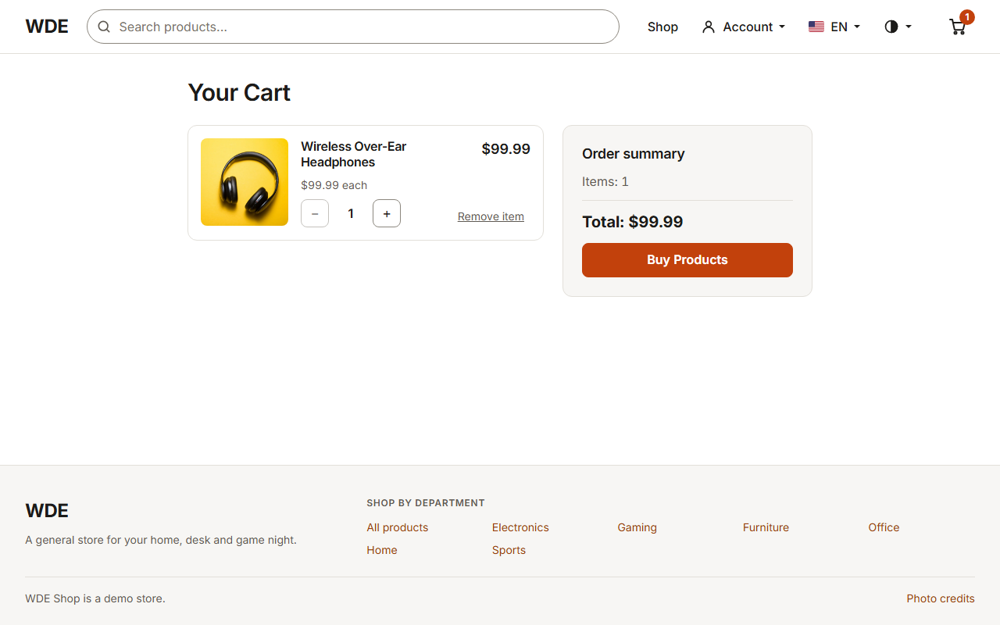
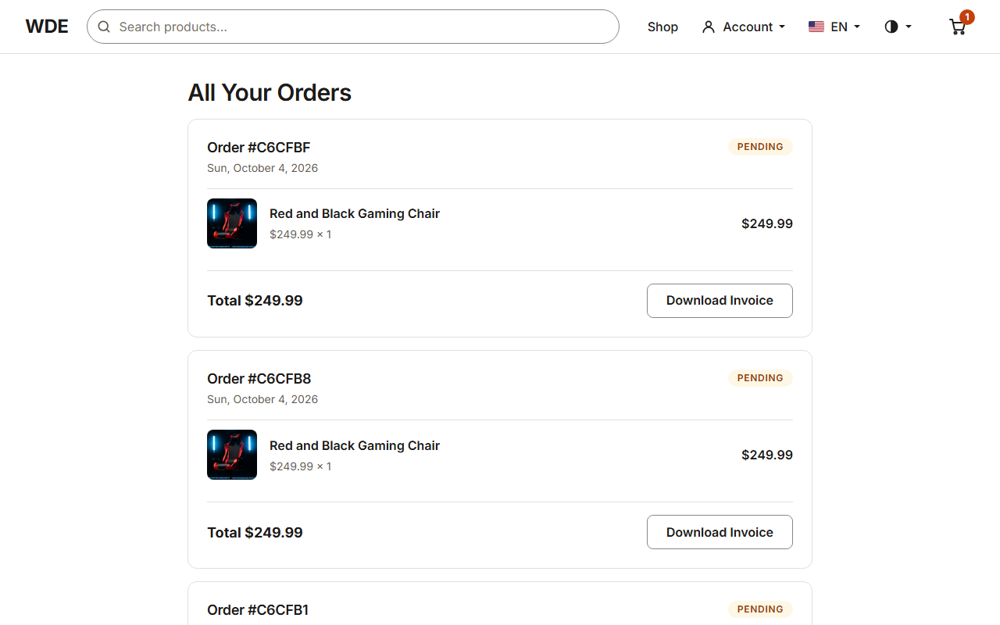
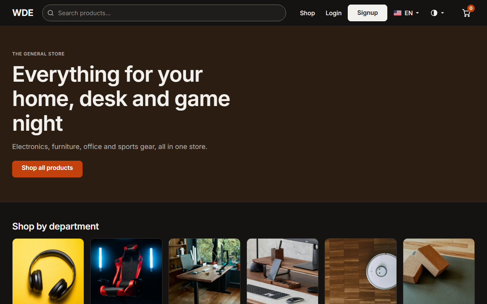
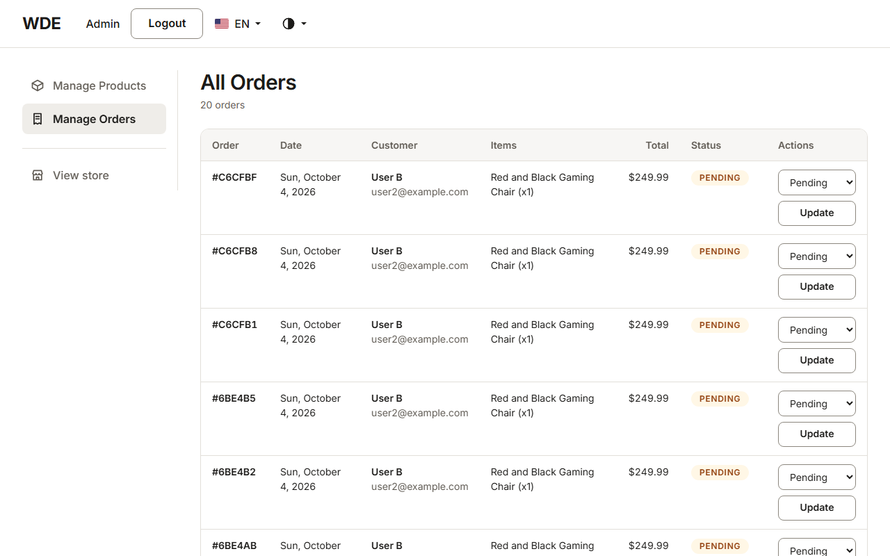

<h1 align="center"> WDE </h1>

<p align="center"> WDE Shop - a full-stack e-commerce demo application</p>

<p align="center">
  <a href="#-technologies">Technologies</a>&nbsp;&nbsp;&nbsp;|&nbsp;&nbsp;&nbsp;
  <a href="#-project">Project</a>&nbsp;&nbsp;&nbsp;

<br>

<p align="center">
  
</p>

<p align="center">
  
  
</p>

<p align="center">
  
  
</p>

<p align="center">
  
</p>

<p align="center">
  
  
</p>

<p align="center">
  
  
</p>

## 🚀 Technologies

This project is built with:

- EJS and CSS (vanilla, no frontend framework or bundler): design tokens, a self-hosted Inter font, and light and dark themes (see [`docs/design-direction.md`](docs/design-direction.md))
- JavaScript, Ajax and Node.js
- MongoDB
- Stripe (test-mode checkout)
- Mailpit (local SMTP catcher for order confirmation and OTP login emails)
- Self-hosted vendor libraries: flatpickr (date picker), Quill (rich text editor)
- Git and GitHub

## 💻 Project

WDE Shop is an e-commerce store with two access levels, available in English and Brazilian Portuguese (language selector in the nav bar):

Administrator:

- Add, edit and delete products - including a rich text description editor (sanitized server-side against stored XSS), a launch-date picker, and drag-and-drop image upload
- Search the product list by name or department
- Manage orders in a sortable table (click any column to sort)
- Sidebar admin shell; the store itself is available as a preview

Customer:

- Start from a home page with department tiles and featured products
- Browse the catalog with department filtering, name/price sorting, and a live search combobox
- View product details (breadcrumbs, related products) and add products to the cart
- Switch between a light and a dark theme (follows the system, or choose from the header menu)
- Pay through the Stripe API (test mode)
- Track the status of past orders, download a PDF invoice for any of them
- Log in with a password, or with a one-time code emailed via Mailpit (no password required)
- Receive an order confirmation email after a successful purchase
- Mobile-optimized design

## 🐳 Running locally with Docker

Prerequisites: [Docker Desktop](https://www.docker.com/products/docker-desktop/).

1. Copy the example environment file and fill in your Stripe test key:

   ```bash
   cp .env.example .env
   # edit .env and set STRIPE_KEY to a test key (sk_test_...) from your Stripe account
   ```

2. Bring up the containers (app + MongoDB + Mailpit). On first run, a `seed` service populates the database automatically:

   ```bash
   docker compose up --build
   ```

3. Visit [http://localhost:3000](http://localhost:3000).

Credentials already seeded:

| Role     | Email              | Password |
| -------- | ------------------ | -------- |
| Admin    | admin@test.com      | tester   |
| Customer | user2@example.com   | usertest |

The seed script also creates a full sample catalog (24 products across 6 departments, including the "Red and Black Gaming Chair") and a pending order, so the application comes up ready to use and ready for automated testing.

MongoDB is reachable at `127.0.0.1:27017` (loopback only) — used by the [`wde-playwright-ts`](https://github.com/Gabriel-Leao51/wde-playwright-ts) suite's security proof-of-concept for `BUG-SEC-005` and its catalog checks, and handy for inspecting the database locally with any MongoDB client.

Mailpit's web UI is reachable at [http://localhost:8025](http://localhost:8025) — every order confirmation and OTP login-code email sent by the app locally ends up there (no real SMTP provider or account needed).

To fully reset the data (removes the MongoDB volume):

```bash
docker compose down -v
```

## 🧪 Automated Testing

This application is the target under test for a companion end-to-end test suite, [`wde-playwright-ts`](https://github.com/Gabriel-Leao51/wde-playwright-ts) (Playwright + TypeScript), covering functional, security, visual regression, responsive and accessibility scenarios across the full feature set described above, on Chromium, Firefox, WebKit and two phone profiles. It also served as the safety net for the redesign. The earlier Python suite, [`wde-test-automation`](https://github.com/Gabriel-Leao51/wde-test-automation), is frozen.

## 📷 Photo credits

Product photos are from [Unsplash](https://unsplash.com) under the [Unsplash License](https://unsplash.com/license), cropped to squares and converted to WebP. The full record (source page, download URL, photographer) is in [`product-data/image-sources.json`](product-data/image-sources.json); `npm run images:fetch` rebuilds the files from it.

| Product | Photo by |
| --- | --- |
| Wireless Over-Ear Headphones | [Photo](https://unsplash.com/photos/flatlay-photography-of-wireless-headphones-PDX_a_82obo) by [C D-X](https://unsplash.com/@cdx2) |
| Wireless Keyboard and Mouse | [Photo](https://unsplash.com/photos/apple-magic-mouse-and-magic-keyboard-TnG2q8FtXsg) by [Hugo Barbosa](https://unsplash.com/@hugobarbosa) |
| Compact Bluetooth Speaker | [Photo](https://unsplash.com/photos/white-and-silver-portable-speaker-on-brown-wooden-table-gbG65gRAGx4) by [Nicolas J Leclercq](https://unsplash.com/@nicolasjleclercq) |
| Desktop Monitor | [Photo](https://unsplash.com/photos/flat-screen-computer-monitor-turned-on-beside-black-keyboard-8GDCzWrcE3M) by [Daniel Korpai](https://unsplash.com/@danielkorpai) |
| USB-C Multiport Hub | [Photo](https://unsplash.com/photos/white-printer-paper-beside-green-plant-lCq0Tfl9-nI) by [Lasse Jensen](https://unsplash.com/@maybejensen) |
| Red and Black Gaming Chair | [Photo](https://unsplash.com/photos/a-red-and-black-gaming-chair-with-blue-lights-CIs7k5TlOic) by [fadoul m](https://unsplash.com/@fadoulmhtnr08) |
| Mechanical Keyboard | [Photo](https://unsplash.com/photos/a-computer-keyboard-sitting-on-top-of-a-wooden-table-4GzqVNX0TCQ) by [JL Cabrera](https://unsplash.com/@thekidph) |
| Wireless Gaming Mouse | [Photo](https://unsplash.com/photos/a-black-computer-mouse-Q-jxVqz0wVQ) by [JL Cabrera](https://unsplash.com/@thekidph) |
| Gaming Headset | [Photo](https://unsplash.com/photos/black-and-red-corded-headphones-on-white-table-w5m3PIGvkqI) by [Fausto Sandoval](https://unsplash.com/@uusaez) |
| Standing Desk | [Photo](https://unsplash.com/photos/wooden-standing-desk-in-home-office-tdnYk4qOGhc) by [ergonofis](https://unsplash.com/@ergonofis) |
| Ergonomic Mesh Office Chair | [Photo](https://unsplash.com/photos/a-gray-office-chair-sitting-next-to-a-wooden-table-7mfNpV5eJH0) by [EFFYDESK](https://unsplash.com/@effydesk) |
| Floating Wall Shelf Set | [Photo](https://unsplash.com/photos/empty-shelves-in-a-white-room-with-a-tile-floor-vv0OomxL4gA) by [Celso A. Torres Pirron](https://unsplash.com/@celsoramone) |
| Live-Edge Coffee Table | [Photo](https://unsplash.com/photos/brown-wooden-table-beside-white-couch-8NxTrV6i4WQ) by [Lui Peng](https://unsplash.com/@luipeng) |
| Wooden Monitor Stand | [Photo](https://unsplash.com/photos/a-computer-desk-with-a-keyboard-mouse-and-cell-phone-mJaLWCgI1KY) by [Oakywood](https://unsplash.com/@oakywood) |
| Compact Photo Printer | [Photo](https://unsplash.com/photos/a-printer-sitting-on-top-of-a-wooden-floor-next-to-a-potted-plant-QbOnQQebbjU) by [Joonas Sild](https://unsplash.com/@joonas1233) |
| Copper Desk Lamp | [Photo](https://unsplash.com/photos/gold-table-almp-VDPauwJ_sHo) by [Sincerely Media](https://unsplash.com/@sincerelymedia) |
| Whiteboard Easel | [Photo](https://unsplash.com/photos/a-white-board-sitting-on-top-of-a-wooden-floor-FYFKBiWLq88) by [Studio VIX](https://unsplash.com/@studiovix_nl) |
| Robot Vacuum Cleaner | [Photo](https://unsplash.com/photos/white-round-ceiling-light-turned-off-DeGvnKKETFM) by [Jan Antonin Kolar](https://unsplash.com/@jankolar) |
| Gooseneck Kettle | [Photo](https://unsplash.com/photos/a-coffee-maker-on-a-table-tVeVHHWCfHM) by [Paul Esch-Laurent](https://unsplash.com/@pinjasaur) |
| Air Purifier | [Photo](https://unsplash.com/photos/a-white-air-conditioner-sitting-on-top-of-a-bed-Yslpbknkg6Y) by [Nicholas Ng](https://unsplash.com/@nicsandman20) |
| Vintage Filament Bulb | [Photo](https://unsplash.com/photos/close-up-photography-of-light-bulb-voQ97kezCx0) by [Johannes Plenio](https://unsplash.com/@jplenio) |
| Yoga Mat and Cork Blocks | [Photo](https://unsplash.com/photos/a-yoga-mat-with-two-blocks-on-top-of-it-b8Q5fHBsyik) by [Samantha Sheppard](https://unsplash.com/@samsheppardphoto) |
| Rubber Hex Dumbbell | [Photo](https://unsplash.com/photos/a-set-of-keys-E3F5VL5EGWg) by [VD Photography](https://unsplash.com/@vdphotography) |
| Insulated Water Bottle | [Photo](https://unsplash.com/photos/green-bottle-on-white-table-reEySFadyJQ) by [Joan Tran](https://unsplash.com/@joanofarts) |
